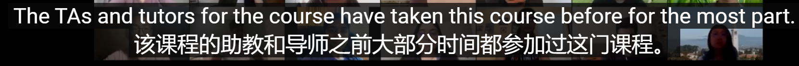

课程主页：

- 20 FALL https://inst.eecs.berkeley.edu/~cs61a/fa20/
- 21 FALL https://inst.eecs.berkeley.edu/~cs61a/fa21/
- textbook：http://composingprograms.com/pages/11-getting-started.html

分享：

- 学习经验__CS61A__完结填坑__总结 - 我要面包的文章 - 知乎 https://zhuanlan.zhihu.com/p/391809891
- https://github.com/HobbitQia/CS61A-Fall-2020
- https://zhuanlan.zhihu.com/p/466043471

第一节课：

TAa:	tutors

A lot of this course is also how to think computationally.

这门课程的很多内容也是如何进行计算思考。

How to think about approaching a problem in a systematic and quantitative and logical way, and solving the problem.

如何以系统、定量和逻辑的方式思考解决问题，并解决问题。

software engineer.

That you're only limited by your imagination and your skills.你只受你的想象力和技能的限制。

And the job of this class and subsequent classes is to expand on your skillset, is to give you these really raw basic tools that allow you to think about The nature of computation and how you can solve problems whether that's analyzing images, text, data from the stock market, data from climate change.

And our goal is to teach you those very generic skills and help you apply those to solve interesting and important, fun, exciting problems as you move forward in your career.

You're going to learn everything when you actually try to solve problems on your own with the support of the course staff and your peers in what's called "lab".

You should watch lecture before that happens, but you should definitely go to the lab orientation.

And this is a tremendously important skill when you're learning about computer science,when you're learning to program.

To be able to figure out whether something works on your own, with your mind, without relying on the computer to do everything for you.

the best way to learn how to do something is to find somebody who knows more about it than you and have them coach you along a little bit.

They won't tell you the answer but they'll tell you how to proceed.

There's a lot of questions about the lab orientations.

vscode guide：

https://inst.eecs.berkeley.edu/~cs61a/fa20/articles/vscode.html

  1.program   就是程序员写的一个完整程序代码。存储在介质中（硬盘，U盘）。

  2.procedure  就是完整程序中的一段完成一定功能的代码，例如一段循环代码或函数。

  3.process   就是一个完整的程序加载到[内存](https://so.csdn.net/so/search?q=内存&spm=1001.2101.3001.7020)运行的形式，是正在运行处于动态状态的program。