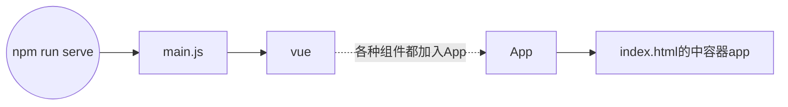
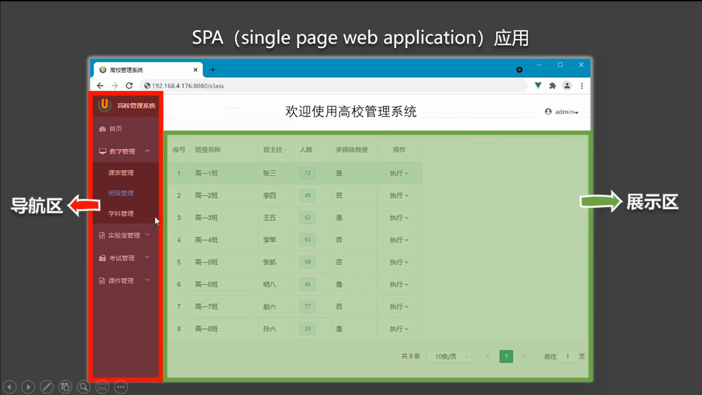
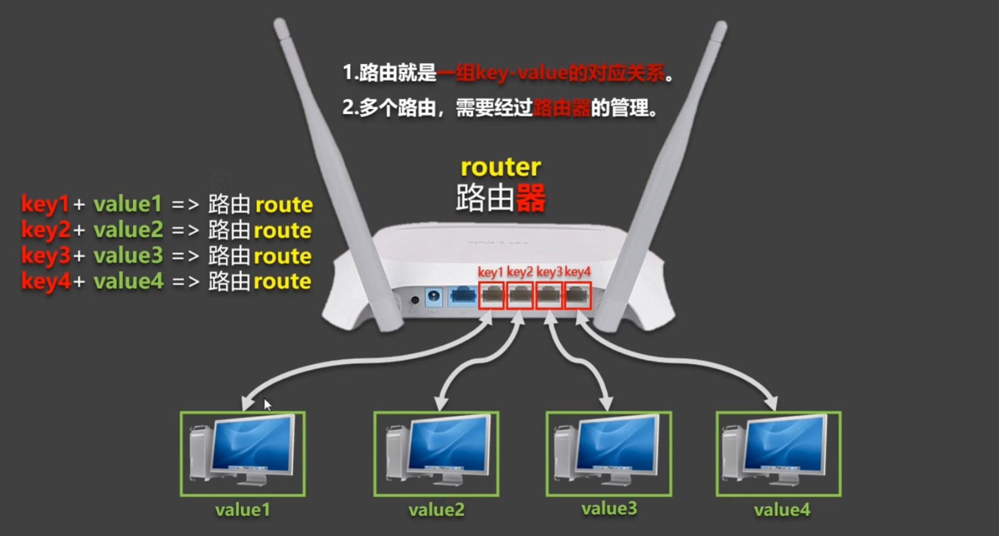
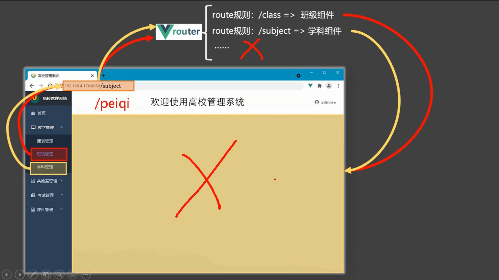
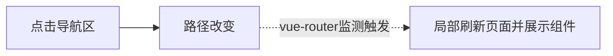
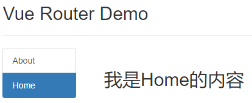

command line interface：命令行接口工具

babel：ES6------>ES5

eslint：语法检

Local：开启的内置的小服务器

Network：同局域网内其他人可以访问的服务端口

脚手架文件结构

```html
.文件目录
├── node_modules 
├── public
│   ├── favicon.ico: 页签图标
│   └── index.html: 主页面
├── src
│   ├── assets: 存放静态资源
│   │   └── logo.png
│   │── component: 存放组件
│   │   └── HelloWorld.vue
│   │── App.vue: 汇总所有组件
│   └── main.js: 入口文件
├── .gitignore: git版本管制忽略的配置
├── babel.config.js: babel的配置文件
├── package.json: 应用包配置文件 
├── package-lock.json: 包版本控制文件
└── README.md: 应用描述文件
```

执行`npm run serve`后，直接运行`main.js`文件(脚手架配置好的)

webpack

node_modules的作用

https://www.cnblogs.com/xiaonian8/p/13714310.html

main.js没有引入到index.html同样找到容器app

执行过程：



要服务的容器app 

es6的模块化语法

```js
import Vue from 'vue'
```

Q：运行时版本的vue不包含模板解析器

A：

1. 引入完整版本的vue
2. 使用render函数


## render函数

意思：渲染

写法

```js
写法一：
render() {
    console.log(typeof a)
    return null
}
写法二：
render: h => h(App)
```

vue = 核心部分 + 模板解析器

模板解析器占1/3体积，太大了

模板解析器用来本地查看，打包完都生成原生js，没必要了

模块化是什么？

vue-cli隐藏了重要的配置文件

暴露语法和模块化的关系

[vue2 中的 export import](https://www.cnblogs.com/perfei/p/13762407.html)

## 配置项props

模板语法和vue实例对象密切相关

默认参数类型是字符串

v-bind: == :动态绑定， 运行""里面的js表达式的结果

age*1 + 1

类似微信支付的模式，我觉得更像C/S

## mixin混入

代码复用

es6分别暴露

## 插件

增强

先开挂，再进游戏

先用插件，再应用vm

express koa Vue.use

## scoped样式

作用域 局部的

vue组件的样式会汇总到一起，相同的样式类名会造成冲突

lang编写样式的语言

`npm view webpack versions`

npm i less-loader@7

兼容性问题

## 组件化的编码流程

1. 实现静态组件：抽取组件，使用组件实现静态页面效果
2. 展示动态数据：
   1. 数据的类型、名称是什么？
   2. 数据保存在哪个组件？

3. 交互——从绑定事件监听开始

拿到业务，先拆分组件，按功能点划分

js存储一系列数据时 用{} []

id用字符串或者哈希值

uuid nanoid

```
<template>
	<div class="todo-header">
		<input type="text" placeholder="请输入你的任务名称，按回车键确认" 
           v-model="title" @keyup.enter="add"/>
	</div>
</template>

<script>
	import {nanoid} from 'nanoid'
	export default {
		name:'MyHeader',
		props:['addTodo'],	// 接收从App传递过来的addTodo
		data() {
			return {
				title:''				// 收集用户输入的title
			}
		},
		methods: {
			add(){
				// 校验数据
				if(!this.title.trim()) return alert('输入不能为空')
				// 将用户的输入包装成一个todo对象
				const todoObj = { id:nanoid(), title:this.title, done:false }
				// 通知App组件去添加一个todo对象
				this.addTodo(todoObj)
				// 清空输入
				this.title = ''
			}
		},
	}
</script>

<style scoped>
	/*header*/
	.todo-header input {width: 560px;height: 28px;font-size: 14px;
    border: 1px solid #ccc;border-radius: 4px;padding: 4px 7px;}
	.todo-header input:focus {outline: none;border-color: rgba(82, 168, 236, 0.8);
		box-shadow: inset 0 1px 1px rgba(0, 0, 0, 0.075), 0 0 8px rgba(82, 168, 236, 0.6);}
</style>
```

npm不行就用cnpm

props只读 传输的是地址


操作系统实验

1. 实验1
   1. 源码执行 分析交替的原因
   2. 注释掉sleep 分析不交替的原因
   3. 注释掉sleep和父子进程同时父子进程的循环次数扩大10 或者 100 或者 1000 反正要求观察到交替的现象

2. 实验2
   1. 源码执行
   2. 源码注释掉3个usleep，观察到交替的现象 分析原因


事件对象


服务器的session会话

js内置事件 keyup click

自定义事件

```js
<Test v-on:shiJian="fangFa"/>
//v-on绑定事件shiJian到组件Test的实例对象上，当事件shiJian触发时，方法fangFa被调用。
```

回调函数

## 全局事件总线

组件X需要的特点：

- 所有的组件可见
- 含有`$on`、 ` $emit`、 `$off`


# 路由 vue-router

## 1.基础概念

**vue-router**

- vue 的一个插件库，专门用来实现 SPA 应用

**SPA 应用**

- 单页 Web 应用（single page web application，SPA）。
- 整个应用==只有一个完整的页面==。 
- 点击页面中的导航链接不会刷新页面，只会做页面的==局部更新==。
- 数据需要通过 ajax 请求获取。



**路由**

什么是路由?

- 一个路由就是一组映射关系（key - value）
- key 为路径, value 可能是 function 或 component



路由分类

1. 后端路由
  - 理解：value 是 function, 用于处理客户端提交的请求。
  - 工作过程：服务器接收到一个请求时, 根据请求路径找到匹配的函数来处理请求, 返回响应数据。 

2. 前端路由
  - 理解：value 是 component，用于展示页面内容。 
  - 工作过程：当浏览器的路径改变时, 对应的组件就会显示。



## 2.基本路由

**路由执行过程**



**效果**



**实现途径**

- 原始html中通过a标签的href属性实现页面之间的跳转
- Vue中借助==router-link标签==实现路由的切换

### 使用步骤

1.安装vue-router：`npm i vue-router@3`

>Vue2匹配vue-router3版本，Vue3匹配vue-router4版本。

2.引入和应用插件vue-router。

配置 `main.js` 文件，引入并安装后，vm上出现新的配置项router，router的值必须是router。

```js
//引入Vue
import Vue from 'vue'
//引入App
import App from './App.vue'
//引入VueRouter
import VueRouter from 'vue-router'
//引入路由器
import router from './router'

//关闭Vue的生产提示
Vue.config.productionTip = false
//应用插件
Vue.use(VueRouter)

//创建vm
new Vue({
	el:'#app',
	render: h => h(App),
	router:router
})
```

3.配置整个文件的路由器router

```js
//引入router
import VueRouter from "vue-router"
//引入组件
import Home from "@/views/Home"
import About from "@/views/About";
import Message from "@/views/Message"
import News from "@/views/News"

//创建一个路由器
const router = new VueRouter({
    routes: [
        {
            path: '/home',
            component: Home,
            children: [
                {
                    path: 'message',
                    component: Message 
                },
                {
                    path: 'news',
                    component: News
                }
            ]
        },
        {
            path: '/about',
            component: About
        }
    ]
})
//暴露router
export default router
```


# 小技巧

## 1.引入第三方样式

在 `index.html` 中 `head` 标签内加入 `<link rel="stylesheet" href="<%= BASE_URL %>css/bootstrap.css">`

## 

## 2.插件的使用（以vue-router为例）

[详情见vue-router的基本路由使用步骤](##使用步骤)
