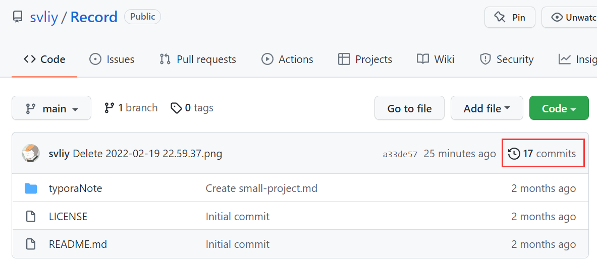
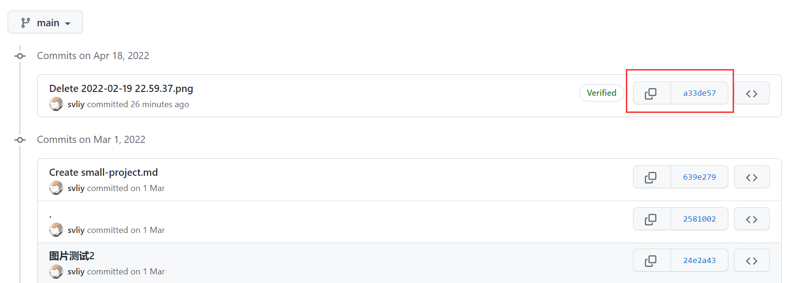
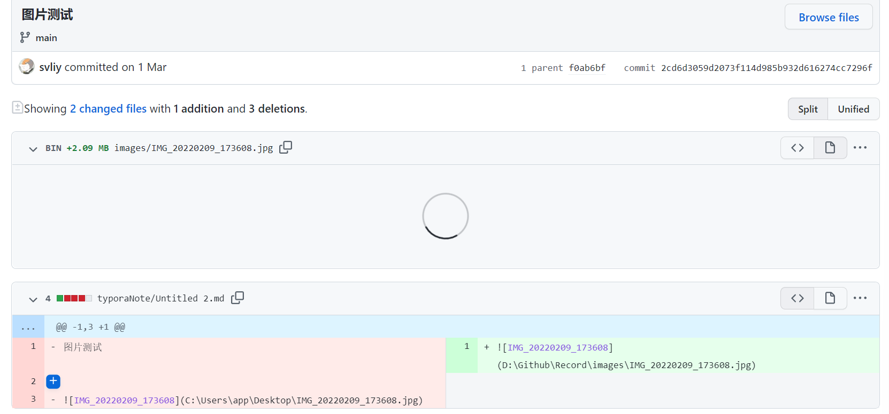

# Git and Github

## 1. 简介

- What？
  - Git是一个运行在你电脑上的==版本控制软件==
  - Github是基于Git这个版本控制软件打造的网站（==代码托管平台==）

- Git
  - 三个概念
    - 提交 commit：以commit为单位记录代码的版本
    - 仓库 repository：代码库，放代码的文件夹，初始化成为仓库。
    - 分支 branch：多人协作开发 版本控制

## 2. Git的安装和使用

### 安装

​		略

### 使用

 	word的撤回功能，版本控制的缩影。git可以把多个的人代码变更以提交的形式做一个存储，方便回滚。

#### 初始化一个仓库

​	仓库 = 文件夹 + .git		命令：`git init`

以typora笔记为例子

#### 第一次提交

​	命令：

- `git add -A` 
- `git commit -m "提交信息"`
- `git log --stat` 查看提交的历史
- `git checkout 'file'` 工作区打回去
- `git reset HEAD^1` Undo commit

#### 推送和拉取

​	`git push`：推送当前分支最新的提交到远程

​	`git pull`：拉取远程分支最新的提交到本地

### 分支

​		多人协作开发。不同的人和需求之间相互隔离，又能好的汇聚到一起。

默认main分支为完成态。

| 命令                          | 作用                     |
| ----------------------------- | ------------------------ |
| git checkout -b <branchname>  | 以当前分支为基础新建分支 |
| git branch                    | 列举所有的分支           |
| git checkout <branchname>     | 切换到某个分支           |
| git branch -D <branchname>    | 删除特定的分支           |
| git merge <branchname>        | 合并分支                 |
| git merge --abort             | 放弃合并                 |
| git remote add origin xxx.git | 和github远程仓库连接     |
| git push -u origin main       | 推送到远端仓库           |

## 3. Github的使用

### 下载代码

- 获取代码仓库的代码托管地址address
- 使用git bash下载git clone address

### License

- MIT License：保留原作者的版权信息，随便使用。

### 查看commit记录

第一步：

第二步：选择某一次提交的hash值

第三步：查看diff，红色是以前的，绿色是新改的。

### 仓库介绍

- Issues：问答的地方。
  - status：==open==：有人提出了issue。==closed==：已经解决了。

### 怎么寻找开源项目

1. 掘金社区
2. Github Trending
3. hello github
4. 阮一峰 科技爱好者周刊
5. 阿里妈妈前端快报
6. 资源查询的技巧
   1. 找百科大全 awesome xxxx
   2. 找例子 xxxx sample
   3. 找空项目的架子 xxxx starter / xxxx boilerplate
   4. 找教程 xxxx tutorial

## 碎片

- 初次入门参考视频：https://www.bilibili.com/video/BV1e541137Tc?spm_id_from=333.337.search-card.all.click

- Mermaid从入门到入土——Markdown进阶语法 https://zhuanlan.zhihu.com/p/355997933

- 图形化git操作要装一个扩展：GitLens

  