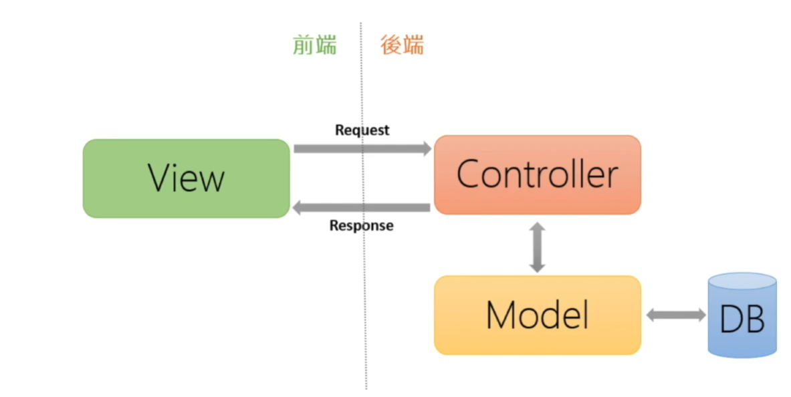

## MVC设计模式



### 什么是设计模式？

设计模式：Web开发过程中总结出的一些套路，或者说模板化的内容。

### 什么是MVC？

- M：model 模型：和数据库进行交互，进行数据的处理。
- V：view 视图
- C：Controller 控制器：数据和请求的调度中心

**例子**：

```text
	开发一个商城网站。
	当一个用户访问商城的首页，相当于向服务器发送一个请求。C（Controller）接受到用户的请求后，发现用户访问的是商城的首页，那么我们需要从数据库中获取商品信息。此时，M（Model）和数据库进行沟通。数据库中的一张表对应为一个model，表中数据由model处理。所有与商品相关的数据交互，以及数据处理，都交给商品model进行处理。此外，还会产生订单表，所有和订单相关的数据处理都由订单model进行管理。商品model和数据库进行交互，从数据表中读取相关的信息，最后再返回Controller控制器。controller控制器接收到数据后，返回给View视图层，View解析数据展示给用户。
```

​	可以看到mvc是**分层**的，**相互独立**的，每一层只负责好本层的内容。那么就可以单独处理。开发人员按照这种模式进行分工。前端开发人员负责好视图展示。后端开发考虑数据的调度和获取 。最后实现的统一的功能。

