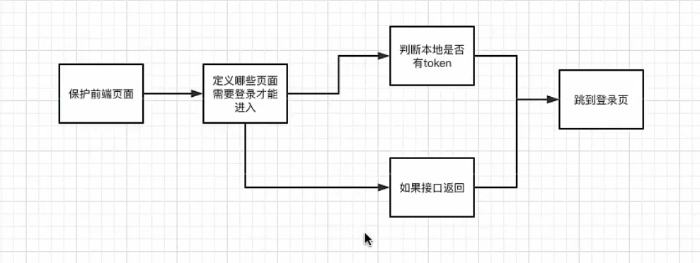
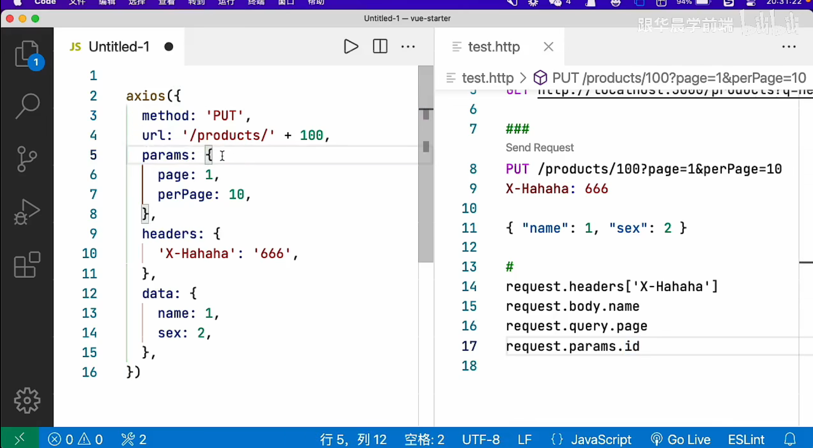
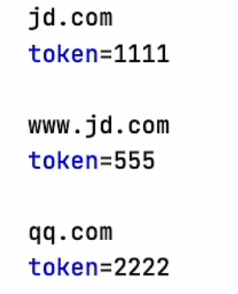
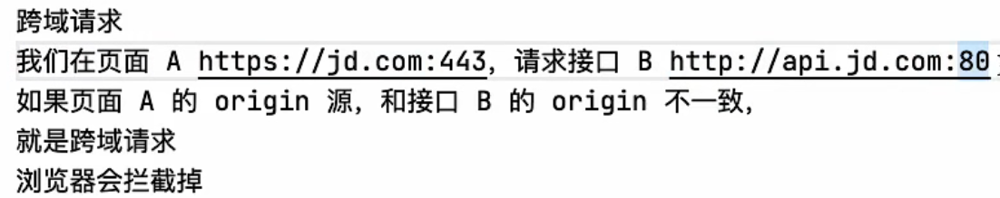
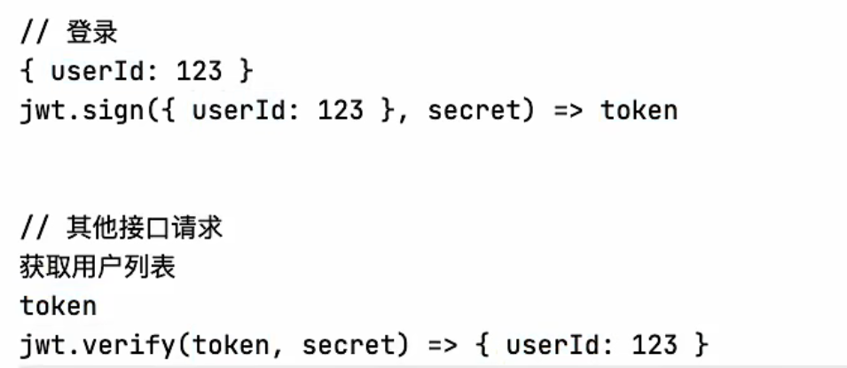

# Vue axios 前端接口请求封装

1. `axios` 接口封装，拆分为 `utils/request.js`  和 `api/*.js`

2. 挂载到 `Vue.prototype.$api` ，方便 `this.$api.products.get()` 调用

3. 理解 `api/*.js ` 中的方法需要 `return` 的原理


## axios的简单使用

1.安装axios 

```sh
npm install axios
```

2.简单使用get和post。

```vue
<template>
    <div class="about">
    <h1>This is an about page</h1>
    <button @click="getFunc">发送get请求</button>
    <button @click="postFunc">发送post请求</button>
  </div>
</template>

<script>
// 引入axios
import axios from 'axios'

export default {
  name: 'About',
  methods: {
    getFunc() {
      axios({
        method:'get',
        url:'http://jsonplaceholder.typicode.com/posts',
        params: {
          id: 1
        }
      }).then( res => {
          console.log(res)
      });
    },
    postFunc() {
      axios({
        method:'post',
        url:'http://jsonplaceholder.typicode.com/posts',
        data: {
          userId: 10086,
          title: '世界在崩坏！！！',
          body: '就这！！！'
        }
      }).then( res => {
          console.log(res)
      });
    }
  }
}
</script>
```

简单写法：

```js
	//get请求
	getFunc() {
      axios.get('http://jsonplaceholder.typicode.com/posts', {
        params: {
          id: 1
        }
      }).then( res => {
          console.log(res)
      });
    },
    //post请求
    postFunc() {
      axios.post('http://jsonplaceholder.typicode.com/posts', {
        userId: 10086,
        title: '世界在崩坏！！！',
        body: '就这！！！'
      }).then( res => {
          console.log(res)
      });
    }
```

3.封装使用。

api目录用来写具体的请求。utils下的 `request.js` 用来配置axios。


将配置好的api绑定到Vue的原型上，实现全局可用。

- es6导入导出
- vue原型链

# 登录逻辑，前后端完整实现

1. 用户名、密码验证成功后，后端签发 `token` 返回给前端
2. 前端把 `token` 保存到本地存储
3. 每次请求前，通过 `axios` 请求拦截器，统一发送 `toker`
4. 通过 `Vue` 导航守卫，和 `axios` 响应拦截器，统一保护页面

为什么要保护页面？

1. 防止绕过登录页面
2. 防止知道后端或者前端接口直接获取数据

网络部分选中过滤掉其他请求


token

- 用户在前端登录并发送请求，后端接收到请求，返回token给前端，前端保存token到用户的本地电脑上。
- token的作用是快速识别用户，实现免密登录。具体的说，用户等一段时间后再打开页面，依然保持登录状态。



了解HTTP状态码

- 401 没登录
- 403 没权限
- 404 资源没找到；请求地址写错了and请求方法
- 400 参数写错了
- 500 后端错误
- 502 后端配置错误
- 503 超载
- 200 成功
- 201 创建成功
- 204 删除成功
- 301 永久重定向
- 302 临时重定向

参数类型

- 路径参数：
- 查询参数？
- 请求体
- 请求头



本地存储和域名相关，彼此之间互不影响



对象解构，数据解构

跨域请求



## 导航守卫

导航：页面跳转就叫导航。

守卫：检测跳转是否合法。

三个参数

- to：页面B的this.$route,存储各种路由信息
- from：页面A的this.$route,存储各种路由信息
- next：运行next会正常跳转，放行。next(false)阻止 next('/xxx/xxx')重定向 （没权限的时候）

通过请求头发送token给后端


