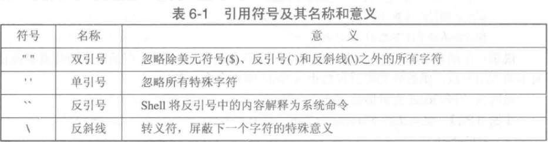

# na:timer_clock:2022/3/16

## 了解混合式线程

用户进程空间 操作系统内核空间

处理器直接分配给内核级线程

类比：主从齿轮

Linux是内核级线程，不支持混合式线程。

Linux线程没有自己的地址空间，

linux用户级进程跟内核线程（进程）有什么差别呢？ - 被吊打的学渣的回答 - 知乎 https://www.zhihu.com/question/25367227/answer/2173684264

进程和线程使用相同的结构

凡是不依靠中断切换的线程。

假线程 线程切换

Linux内核初探:进程与线程 - 欧乐为的文章 - 知乎 https://zhuanlan.zhihu.com/p/93553600

## 处理器调度系统

### 选择调度算法

什么是作业？

周转时间：批处理作业

交互式作业

带权周转时间的意义

shell脚本 

用==对换指令==实现临界区的互斥访问。

进程P1进入临界区访问共享变量

# 3.3同步

寻找解决实现任意数目进程的同步互斥的方法。

Dijkstra同步工具： 

信号量：

注意符号统一，使用PV

在最坏情况下不会发生死锁，那就不会发生死锁。


ls -l

列目录属性rwx 属主。。。。。？？？？

可执行程序c1存在

执行命令前执行权限

执行命令

执行命令后执行权限


a换u，g,o

运行是否报错

属性改变ls -l


rwx

111 001 001

u     g      o 

a


13属主存在

外部命令 在磁盘上存储的 操作系统

、

./c1错误结果

不加‘’


看是不是命令

加上单引号‘命令’


加上单引号 看看不同


9.！【】


# 6. 批处理操作接口

## 简介

### 什么是Shell程序？

- Shell 是指一种由c语言白编写的应用程序，这个应用程序提供了一个界面，用户通过这个界面访问操作系统内核的服务。


### 什么是Vim？

- vim 则可以说是程序开发者的一项很好用的工具。
- Vim 是从 vi 发展出来的一个文本编辑器。代码补全、编译及错误跳转等方便编程的功能特别丰富，在程序员中被广泛使用。

## 6.1 Shell 内部命令

### 基本命令

| 命令  | 作用                                                 |
| ----- | ---------------------------------------------------- |
| type  | type命令可以判断一个命令(指令)是内部命令还是外部命令 |
| alias | alias命令用来设置指令的别名                          |

### 多命令执行

> `; and && and ||`

- `;`间隔的多条命令==顺序执行==;
- `&&`间隔，前面的命令执行==成功==则后面的命令继续执行
- `||`间隔，间隔，前面的命令执行==失败==则后面的命令继续执行

## 6.2 Shell编程

> ==结构化==的shell命令集合，实现操作的自动化。

### 变量赋值 =

- 不建议加空格
- 字符串赋值加""
- 变量之间的赋值`$`取值

### 变量引用 $

- echo ${var}
- echo $var

### 清除变量值 unset

### 查看某些环境变量值 echo

```shell
#查看主机名
iame@ubuntu:~/tmp/exp/exp_11-12$ echo $HOSTNAME
ubuntu
#查看主机架构
iame@ubuntu:~/tmp/exp/exp_11-12$ echo $HOSTTYPE
x86_64
#查看主机类型的GNU标识
iame@ubuntu:~/tmp/exp/exp_11-12$ echo $MACHTYPE
x86_64-pc-linux-gnu
#查看命令搜索路径
iame@ubuntu:~/tmp/exp/exp_11-12$ echo $PATH
/home/iame/.vscode-server/bin/dfd34e8260c270da74b5c2d86d61aee4b6d56977/bin/remote-cli:/usr/local/sbin:/usr/local/bin:/usr/sbin:/usr/bin:/sbin:/bin:/usr/games:/usr/local/games:/snap/bin
```

### 设置或显示环境变量 export

> Shell启动后，其中的环境变量生效。未用export定义的变量只是当前Shell 的局部变量，只对当前Shell有效，对其子Shell 无效，因为该变量无法传递给子Shell。==export可以将新设置的环境变量传给当前Shell的子Shell，使其在子Shell中有效。==

- 添加路径前确保路径存在 
- 学会启动和退出子shell
- 只有在`export 变量`后，在子shell中才会可见变量

```shell
iame@ubuntu:~/tmp/exp/exp_11-12$ export PATH=/tmp/exp/exp_11-12:$PATH
iame@ubuntu:~/tmp/exp/exp_11-12$ echo $PATH
/tmp/exp/exp_11-12:/home/iame/.vscode-server/bin/dfd34e8260c270da74b5c2d86d61aee4b6d56977/bin/remote-cli:/usr/local/sbin:/usr/local/bin:/usr/sbin:/usr/bin:/sbin:/bin:/usr/games:/usr/local/games:/snap/bin
iame@ubuntu:~/tmp/exp/exp_11-12$ bash
iame@ubuntu:~/tmp/exp/exp_11-12$ echo $PATH
/tmp/exp/exp_11-12:/home/iame/.vscode-server/bin/dfd34e8260c270da74b5c2d86d61aee4b6d56977/bin/remote-cli:/usr/local/sbin:/usr/local/bin:/usr/sbin:/usr/bin:/sbin:/bin:/usr/games:/usr/local/games:/snap/bin
```

### shell脚本程序访问命令行参数

> 在命令终端上，命令名和命令参数的名字依次为`$0，$1，...，$9，${10}，...`。通过这些参数名字可以获得命令行上的实际参数。

```shell
iame@ubuntu:~/tmp/exp/exp_11-12$ cat spa1.sh 
#!/bin/bash
echo "脚本名字：$0"
echo "参数个数：$#"
echo "参数列表：$@ or $*"
echo "参数1：$1"
echo "参数2：$2"
echo "参数3：$3"
iame@ubuntu:~/tmp/exp/exp_11-12$ . ./spa1.sh 1 2 3
脚本名字：bash
参数个数：3
参数列表：1 2 3 or 1 2 3
参数1：1
参数2：2
参数3：3
```

### 脚本文件的四种执行方式

- 第1种要求脚本文件有执行权限
- ‘.”命令、source命令和 bash命令可用于执行脚本文件，但不能执行二进制程序。
- 显示脚本名字是第1和4种方式

```shell
iame@ubuntu:~/tmp/exp/exp_11-12$ ls -l spa1.sh 
-rw-rw-r-- 1 iame iame 153 4月  18 04:06 spa1.sh
# 方式1
iame@ubuntu:~/tmp/exp/exp_11-12$ ./spa1.sh
bash: ./spa1.sh: 权限不够
# 方式2
iame@ubuntu:~/tmp/exp/exp_11-12$ . ./spa1.sh 
脚本名字：bash
参数个数：0
参数列表： or 
参数1：
参数2：
参数3：
# 方式3
iame@ubuntu:~/tmp/exp/exp_11-12$ source ./spa1.sh 
脚本名字：bash
参数个数：0
参数列表： or 
参数1：
参数2：
参数3：
# 方式4
iame@ubuntu:~/tmp/exp/exp_11-12$ bash ./spa1.sh 
脚本名字：./spa1.sh
参数个数：0
参数列表： or 
参数1：
参数2：
参数3：
```

### 查看返回命令 $?

> 执行完一条命令后，可以使用echo $?查看刚刚执行完的命令返回值。若返回值为0,则表示命令成功执行;否则,表示命令执行失败。

- 当运行程序时，返回值为程序的返回值

```shell
iame@ubuntu:~/tmp/exp/exp_11-12$ cat a.c
#include<stdio.h>
int main(){
        printf("Hello World!!!\n");
        return 10;
}
iame@ubuntu:~/tmp/exp/exp_11-12$ ./a.out 
Hello World!!!
```

### 数组赋值 、引用、操作

#### 数组赋值

- 在创建一个数组的同时进行赋值
- 查看变量值建议为`echo ${array[index]}`

以创建一个array为例子

```shell
iame@ubuntu:~/tmp/exp/exp_11-12$ array=(1 2 3 '4' "5")  # 整体赋值
iame@ubuntu:~/tmp/exp/exp_11-12$ echo ${array[3]}
4
iame@ubuntu:~/tmp/exp/exp_11-12$ echo ${array[4]}
5
iame@ubuntu:~/tmp/exp/exp_11-12$ array[3]=10  # 单个赋值
iame@ubuntu:~/tmp/exp/exp_11-12$ echo ${array[3]}
10
iame@ubuntu:~/tmp/exp/exp_11-12$ array=([1]=1 [5]=2) # 局部赋值
iame@ubuntu:~/tmp/exp/exp_11-12$ echo ${array[*]}
1 2
iame@ubuntu:~/tmp/exp/exp_11-12$ echo ${array[2]}

```

#### 数组引用

- 整体引用 `${array[@]} or ${array[*]}`
- 局部引用 `${array[index]}`
- 存在就显示，不存在就不显示

#### 数组操作

| 命令                                 | 功能                                               |
| ------------------------------------ | -------------------------------------------------- |
| `${#array[@]} or ${#array[*]}`       | 获取数组长度 `#`                                   |
| `${#array[index]}`                   | 获取数组元素长度                                   |
| `${array[*]:start_index:number}`     | `截取数组`：获取数组中自某个下标位置起的若干个元素 |
| `${array[index]:start_index:number}` | 截取数组中的元素                                   |
| `($arr1[@] $arr2[@])`                | 连接数组，注意中间的`空格`                         |
| `(${array[@]/指定元素值/新的值})`    | `replace`替换数组中的元素                          |
| `unset array_name/array[index]`      | 取消数组或者数组元素                               |

### 变量的作用域：全局变量和局部变量

> 变量作用域即变量的作用范围或者其可见性。变量使用的范围有==Shell脚本文件范围==、==函数范围==。

- 不同Shell 脚本文件中名称相同的变量是不同的变量
- 函数中与函数外的变量作用域规则
  1. Shell脚本中函数外部定义的变量是==全局(global)==的，其作用域从被定义的地方开始，到Shell结束或被显式删除的地方为止。 
  2. Shell函数定义的变量默认是全局的，其作用域从“函数被==调用==时执行变量定义的地方”开始，到 ==Shell结束==或被显式删除的地方为止。
  3. 函数中的变量可以定义成 ==local类型==的，其作用域==局限于函数内==。
  4. 函数的位置参数是==local类型==的。脚本命令行参数是==global类型==的。
  5. 同名local变量屏蔽global变量。
- 在函数sfunc中和函数外均可引用==位置参数==，例如$@，但函数中的位置参数指向函数调用参数，函数外的位置参数指向Shell脚本命令行参数。

### 转义 \

> 输出系统预定义功能字符时需用转义符号“\”。

- echo做为标准输出，可以显示不带参数的任何东西
- 转义例子：`echo China\'s panda`

### 引用

- 单引号的作用可以概括为==所见即所得==，即将单引号内的内容原样输出，即单引号里面看见的是什么，就会输出什么。
- 双引号的作用可以概括为==解释代换输出==，即在输出双引号中的内容时，如果其中有`命令`、变量等，则先解析变量、命令的==结果==，然后输出最终内容。如果字符串中无空格，则双引号有时可省略。



### 命令替换 $() and ``

## awk

## 命令集

| 命令      | 作用                                          |
| --------- | --------------------------------------------- |
| `la`      | 查看当前目录下的文件，包含隐藏文件            |
| `echo $?` | 查看上一条命令执行后的返回值，一般0是正确执行 |
| `ls -l`   | 查看文件的属性                                |

shell

测试case 70 20.1 -20

fruits="apple orange banana pear"

输入数字

echo $fruits[2] , 

echo ${fruits[*]}


5.

sum = $(sum+VAR)

$(sum = sum + VAR)

6.

修改程序计算1 3 5 ...


问题：

> cpu ----> 2:1234 （段号+段内偏移）
>
> 怎么找物理地址？


采用分页存储管理来运行分段程序。怎么转变成物理地址？

# 虚拟存储器

主流的存储管理方案是？

扩充主存储器。

## 虚拟存储器原理

### 定义

​		在具有层次结构存储器 的计算机系统中，采用自动实现部分装入和部分对换功能，为用户提供一个比物理主存容量大得多的，可寻址的一种“主存储器”称为`虚拟存储器` 。

### 实现虚拟存储器的基础-程序执行的局部性原理


# 问题集

1. 数组是怎么实现的？像在白板上画画。
2. 程序是顺序执行的，脚本也是顺序执行。程序的定义位置和出现的位置不同。出现在哪里就复制粘贴。

