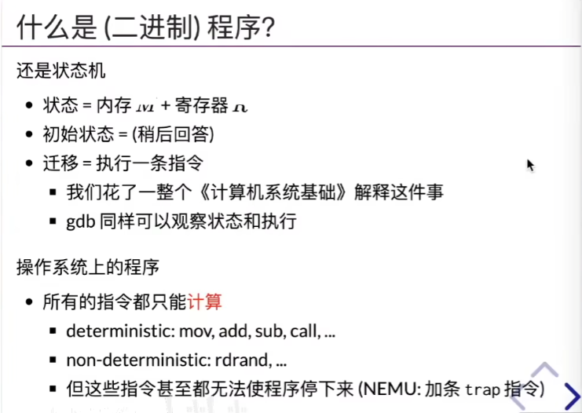
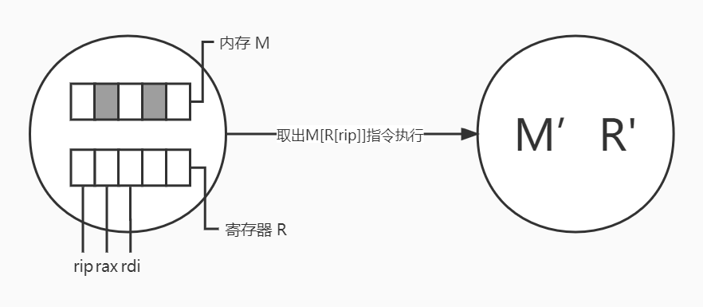
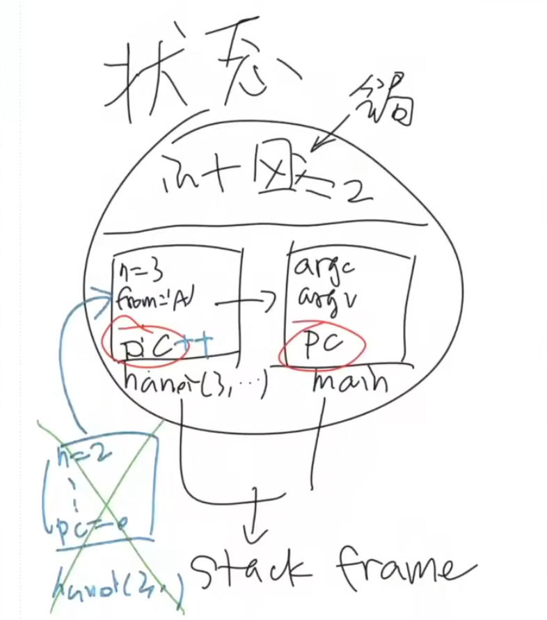

课程主页：http://jyywiki.cn/OS/2022/

视频地址：https://www.bilibili.com/video/BV12L4y1379V?spm_id_from=333.999.0.0

## 操作系统上的程序(什么是程序和编译器？)

X86 64的指令集合

二进制代码视角下的程序在CPU上的执行过程

什么是模拟器？

## 程序是状态机的理解层次

1. 数字电路层面：状态是==布尔代数的组合==，每经过一个时钟周期，状态进行变化。

2. C语言层面：

   1. 状态：==内存中所有的东西==视为一个状态，简单的总结为==堆栈==。此时C语言具体的执行是不清楚的。

   2. 状态：状态是==stack frame+全局变量==。回答什么是函数调用，什么是函数返回？这时候你就可以写C语言的解释器了。

      

   3. 是

3. 短发